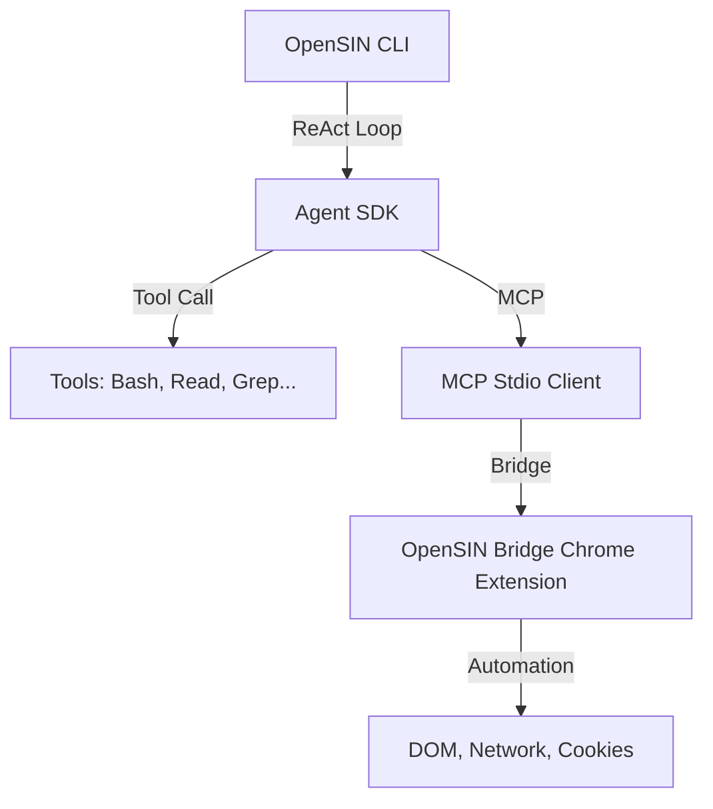

# OpenSIN-Code

> The autonomous OpenSIN CLI with full browser & computer-use capabilities.

## 🚨 CI/CD MANDAT — ABSOLUTES VERBOT FÜR NORMALE GITHUB ACTIONS

**NIEMALS normale GitHub Actions Runner von GitHub nutzen!** GitHub Actions Billing blockiert unsere Pipelines. Dieses Repository nutzt **ausschließlich** n8n + sin-github-action für CI/CD. Alle Builds laufen auf dem kostenlosen OCI VM (Oracle Cloud Always-Free).

- **GitHub Action:** `OpenSIN-AI/sin-github-action` (curl-only, ~2s)
- **n8n Webhook:** `http://92.5.60.87:5678/webhook/opensin-ci`
- **CI Runner:** `opensin-ci-runner.py` als systemd Service auf OCI VM
- **Vollständige Doku:** [docs.opensin.ai/best-practices/ci-cd-n8n](https://docs.opensin.ai/best-practices/ci-cd-n8n)

**Setup für Repos:** Secret `N8N_CI_WEBHOOK_URL` setzen und `.github/workflows/ci.yml` aus der Doku übernehmen. Keine selbstgeschriebenen GitHub Workflows mit `runs-on: ubuntu-latest` für Build/Test/Lint — immer nur den Delegator verwenden!

## Features

- **AI-Powered Coding**: Autonomous code generation, refactoring, and debugging
- **OpenSIN Bridge**: Chrome Extension mit 39 MCP Tools, besser als Antigravity
- **sinInChrome Integration**: Browser automation via MCP (13 actions, 7 browsers)
- **sin-computer-use Integration**: macOS GUI automation (screen capture, input, app management)
- **MCP Server**: Full Model Context Protocol support
- **A2A Protocol**: Agent-to-Agent communication
- **Multi-Provider**: OpenAI, Google, NVIDIA NIM support

## CLI Status

| Phase | Feature | Status | PR |
|-------|---------|--------|-----|
| 2.1 | Core Agent Loop (Query → API → Tools → Repeat) | ✅ Merged | [#359](https://github.com/OpenSIN-AI/OpenSIN-Code/pull/359) |
| 2.2 | CLI Tool System (Bash, Read, Write, Edit, Grep, Glob) | 🔄 In Progress | — |
| 2.3 | MCP Integration | ✅ Merged | — |
| 2.4 | Permission System | ✅ Merged | — |
| 2.5 | Session Persistence | ✅ Merged | — |
| 2.6 | System Prompt Builder | ✅ Merged | — |
| 2.7 | Skill System | ✅ Merged | — |

### Current Build Status
- **TypeScript:** ✅ 0 errors
- **Tests:** ✅ 334/334 passing
- **Branch:** `main` (up to date)

## Browser & Computer Use

OpenSIN-Code now includes enterprise-grade browser and desktop automation:

### sinInChrome (Browser Automation)
- Navigate, click, type, screenshot, read pages
- Console access and network monitoring
- Tab management and tracking
- Multi-browser: Chrome, Brave, Arc, Chromium, Edge, Vivaldi, Opera

### sin-computer-use (macOS GUI Automation)
- Full macOS screen capture via SCContentFilter
- System-wide mouse and keyboard input
- App management (open, close, hide, enumerate)
- Clipboard operations with round-trip verification
- Mouse animation (ease-out-cubic at 60fps)
- ESC abort mechanism via CGEventTap

## Quick Start

```bash
npm install
npm run build
opensin-code
```

## Documentation

Full documentation: **[docs.opensin.ai](https://docs.opensin.ai)**

| Section | Link |
|---------|------|
| Getting Started | [Guide](https://docs.opensin.ai/guide/getting-started) |
| Browser Automation | [sinInChrome](https://docs.opensin.ai/sin-in-chrome) |
| Computer Use | [sin-computer-use](https://docs.opensin.ai/sin-computer-use) |
| API Reference | [API](https://docs.opensin.ai/api/overview) |

## 🧭 OpenSIN-AI Agent Roadmap

- Feature spec: [OpenSIN-overview/docs/opensin-ai-agent-feature-spec.md](https://github.com/OpenSIN-AI/OpenSIN-overview/blob/main/docs/opensin-ai-agent-feature-spec.md)
- Comparison guide: [OpenSIN-documentation/docs/guide/opensin-ai-agent-features.md](https://github.com/OpenSIN-AI/OpenSIN-documentation/blob/main/docs/guide/opensin-ai-agent-features.md)
- This repo now ships the orchestrator-aware OpenSIN-Code runtime and CLI surface.

## 📚 Documentation

This repository follows the [Global Dev Docs Standard](https://github.com/OpenSIN-AI/Global-Dev-Docs-Standard).

For contribution guidelines, see [CONTRIBUTING.md](CONTRIBUTING.md).
For security policy, see [SECURITY.md](SECURITY.md).
For the complete OpenSIN ecosystem, see [OpenSIN-AI Organization](https://github.com/OpenSIN-AI).

## 🔗 See Also

- [OpenSIN Core](https://github.com/OpenSIN-AI/OpenSIN) — Main platform
- [OpenSIN-Code](https://github.com/OpenSIN-AI/OpenSIN-Code) — CLI
- [OpenSIN-backend](https://github.com/OpenSIN-AI/OpenSIN-backend) — Backend
- [OpenSIN-Infrastructure](https://github.com/OpenSIN-AI/OpenSIN-Infrastructure) — Deploy
- [Global Dev Docs Standard](https://github.com/OpenSIN-AI/Global-Dev-Docs-Standard) — Docs

---

## 🏗️ Architecture (Visual Evidence)




*Proof of execution: The CLI actively drives the entire Agent-to-Agent fleet.*


---

## Agent Configuration System (v5)

OpenSIN-Code is the core CLI that powers all A2A agents. The agent configuration system is centralized:

| Datei | Zweck | Repo |
|:---|:---|:---|
| `opencode.json` | Haupt-Config (Provider, Modelle, MCPs, Agenten) | `upgraded-opencode-stack` |
| `oh-my-sin.json` | Zentrales A2A Team Register | `upgraded-opencode-stack` |
| `oh-my-openagent.json` | Subagenten-Modelle (explore, librarian, etc.) | `upgraded-opencode-stack` |
| `my-sin-team-code.json` | Team Coding Agenten + Modelle | `upgraded-opencode-stack` |
| `my-sin-team-worker.json` | Team Worker Agenten + Modelle | `upgraded-opencode-stack` |
| `my-sin-team-infra.json` | Team Infra Agenten + Modelle | `upgraded-opencode-stack` |

### Subagenten-Modelle

| Subagent | Modell | Fallback-Kette |
|:---|:---|:---|
| **explore** | `nvidia-nim/stepfun-ai/step-3.5-flash` | gemini-3-flash → gpt-5.4 → gemini-3.1-pro → claude-sonnet → qwen |
| **librarian** | `nvidia-nim/stepfun-ai/step-3.5-flash` | gemini-3-flash → gpt-5.4 → gemini-3.1-pro → claude-sonnet → qwen |

### ULTIMATE Creation Skill

Use `/create-a2a-sin-agent` to create new agents, teams, or coders. This skill merges three former skills into one.

→ [Full Documentation](https://github.com/OpenSIN-AI/OpenSIN-documentation/blob/main/docs/guide/agent-configuration.md)
