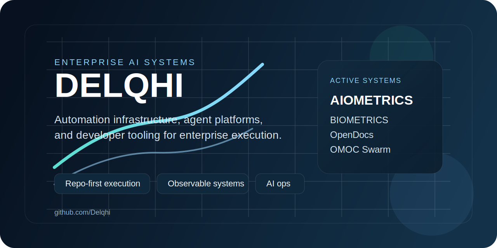

<picture>
  
</picture>

# Delqhi

I build enterprise AI systems through AIOMETRICS: agent platforms, automation infrastructure, and developer tooling that turn complex workflows into repeatable operating systems.

## Focus

- Multi-agent orchestration for engineering and operations
- Documentation-native workflow systems
- Browser automation and AI-assisted execution
- Production-minded tooling with clear control surfaces and observability

## Selected systems

| Project | What it does | Stack |
| --- | --- | --- |
| [BIOMETRICS](https://github.com/Delqhi/BIOMETRICS) | Autonomous coding control plane for operator workflows, governance, and execution. | Go, TypeScript |
| [OpenDocs](https://github.com/Delqhi/opendocs) | Documentation and workflow platform for structured operating knowledge. | TypeScript |
| [OpenDocs Editor](https://github.com/Delqhi/opendocs-editor) | Editing surface for block-based docs and workflow authoring. | TypeScript |
| [OMOC Swarm](https://github.com/Delqhi/opencode-omoc-swarm) | Multi-agent swarm runtime for OpenCode with parallel execution patterns. | TypeScript |
| [OpenCode BIOMETRICS Plugin](https://github.com/Delqhi/opencode-biometrics-plugin) | Plugin layer for bootstrapping and operating BIOMETRICS inside OpenCode. | TypeScript |
| [AgentJudgeKernel](https://github.com/Delqhi/AIOMETRICS-AgentJudgeKernel) | AI evaluation and decision kernel for agent-driven workflows. | TypeScript |

## Operating principles

- Build systems that combine product, docs, and operations instead of treating them as separate layers.
- Prefer repo-first execution, explicit contracts, and reproducible automation.
- Ship tools that reduce manual coordination and increase decision velocity.

## Reach

- Website: [delqhi.com](https://www.delqhi.com)
- GitHub: [github.com/Delqhi](https://github.com/Delqhi)

If you care about enterprise AI automation, developer tooling, or document-native systems, we should talk.
